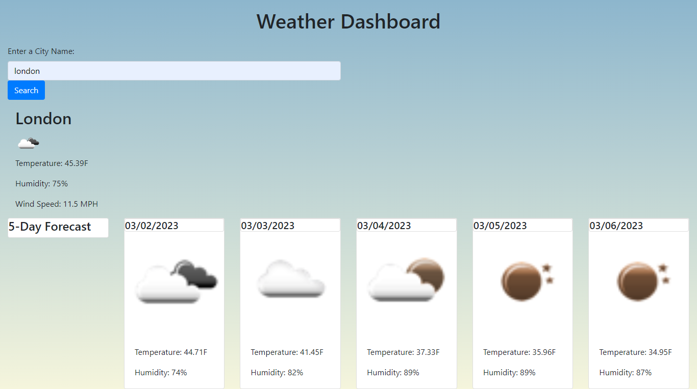

# Weather-Dashboard

## Getting Started:

Simply open up the deployed link [Weather-Dashboard](https://realstranger01.github.io/Weather-Dashboard/) and explore the website:



### Prerequisites

You need to have a modern browser able to handle html5 and css.

Some popular browsers are:
```

Google Chrome
Mozilla Firefox
Safari
Opera
Edge
```
### Description

I made this project because I wanted to integrate a third party API into my code. I call the OpenWeather API and get the current weather as well as a 5 day forecast. I used 2 of their API's, 5 Day Weather and one call. I used 5 day weather so that I can pass in a zip code or city name and get back latitude and longitude. I take those coordinated and call the One Call API so that I can retrieve the UV Index and a cleaner version if the 5 day forecast. This project also stores the city search history to local storage and renders it upon page load.

### Installation

The intallation process consisted of:
```

* Application deployed at live URL.

* Application loads with no errors.

* GitHub repository contains application code.
```

### What I Learned

Writing this project has been an incredibly valuable learning experience for me. Throughout the development process, I gained a deeper understanding of the importance of making API calls to access and integrate diverse data sets into applications. This experience has broadened the scope of data I can work with in current and future projects, providing me with the ability to create more robust and dynamic applications.

## Built With

* Html

* CSS

* Javascript

## licence

Please refer to the licence in the repo.

## Author

* Hamza Osman - Intial work - [RealStranger](https://github.com/Realstranger01/Weather-Dashboard.git)